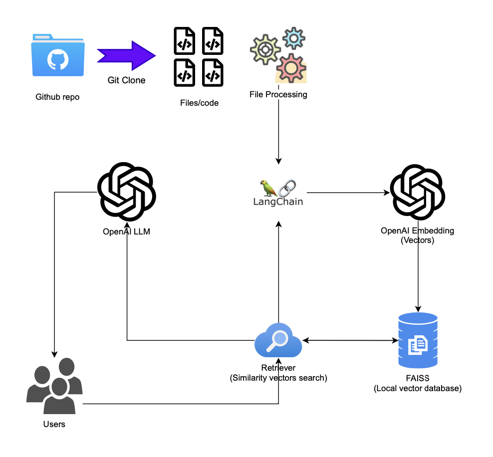

# GitGenius

GitGenius is a powerful tool designed to clone a GitHub repository, read all files, and create a document retrieval system using FAISS and OpenAI embeddings. This project leverages LangChain for natural language query processing to provide relevant information from the cloned repository.

## Features

- **Repository Cloning:** Clone any GitHub repository into a local directory.
- **File Reading:** Read and preprocess all files within the cloned repository.
- **Embeddings Generation:** Utilize OpenAI embeddings to create document embeddings.
- **Vector Storage:** Store embeddings in a FAISS vector store for efficient retrieval.
- **Document Retrieval:** Retrieve relevant documents based on user queries.

## Architecture

<!-- 
 -->
<div style="text-align:center;">
    
</div>

## Installation

### Prerequisites

- Python 3.8 or higher
- Git
- An OpenAI API key

### Steps

1. Clone the repository:

```bash
git clone https://github.com/your-username/GitGenius.git
cd GitGenius
```

2. Install the required dependencies:

```bash
pip install -r requirements.txt
```

3. Set your OpenAI API key in an `.env` file:

```plaintext
OPENAI_API_KEY=your-openai-key
```

4. Set up the project environment and directories:

```sh
make setup
```

### Makefile

The project includes a Makefile with useful targets:

- install: Installs dependencies listed in requirements.txt.
- run: Executes the main Python script.
- setup: Creates necessary directories.
- clean: Deletes cloned_repo and vector_database.

### Setup with setup.py

You can also install GitGenius using the `setup.py` script:

```bash
python setup.py install
```

## Usage

1. Clone a repository:

   The script clones the specified repository and reads all files within it.

2. Process documents:

   The contents of the files are processed, and embeddings are generated using OpenAI embeddings.

3. Create and save a FAISS vector store:

   The embeddings are stored in a FAISS vector store, which is saved locally.

4. Retrieve documents:

   Use natural language queries to retrieve relevant documents from the vector store.

## Example

To run the example provided in the main.py script, simply execute:

```bash
python main.py
```

or

```bash
make run
```

This will clone the repository specified in repo_url, process the documents, and perform a query to demonstrate the retrieval capabilities.

### Cleaning Up

If you want to clean up all generated files and directories from the project (excluding the cloned repository):

```sh
make clean
```

## License

This project is licensed under the MIT License. See the [LICENSE](LICENSE) file for more details.

## Acknowledgements

- [FAISS](https://github.com/facebookresearch/faiss)
- [OpenAI](https://openai.com/)
- [LangChain](https://github.com/langchain/langchain)
